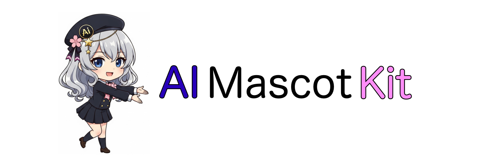

# AIMascotKit



## 概要

AIMascotKitは、VRMモデルを使用したAIキャラクターのデスクトップマスコットを誰でも簡単に作成できるツールキットです。リアルタイムで感情表現、音声合成、スクリーンショット解析をはじめ、Spotifyなどの外部サービスとも連携して自然な対話体験を提供します。

## 🖥️ 対応環境
- macOS (推奨)  
  ※スクリーンショット解析はmacOS専用  
- Linux / Windows: 一部機能制限あり（動作検証中）

## 主な機能

### 🎭 VRM アバター制御
- **3D VRMモデル表示**: Three.jsベースの高品質な3Dレンダリング
- **感情ベース表情変化**: 感情に対応した滑らかな表情遷移
- **VRMAアニメーション再生**: 感情に連動した自然なボディアニメーション
- **リアルタイム口パク**: 音声に同期したリップシンク機能

### 🧠 AI 対話システム
- **Google Gemini統合**: 高性能な会話生成とマルチモーダル対応
- **感情分析**: 会話内容からリアルタイムで感情を検出
- **ご機嫌度診断**: ユーザーとの対話を通じたムード分析
- **画像理解**: 必要に応じてスクリーンショットを解析した文脈理解

### 🎤 音声処理
- **音声認識**: リアルタイム音声入力対応
- **音声合成**: AivisSpeech APIを使用した自然な音声生成
- **自動字幕**: 日本語・英語の双方向字幕表示

### 🖥️ 画面解析
- **自動スクリーンショット**: アクティブウィンドウの自動キャプチャ(音声入力モードのみ)
- **キャプチャするウィンドウの選択**: 初期設定はChrome(手入力モードのみ)
- **画像要求検出**: 対話内容から画面情報が必要かを自動判断
- **マルチアプリケーション対応**: Chrome、Safari等の主要アプリに対応

### 📋 タスク実行機能
- **タスク自動分類**: ユーザーリクエストの種類を自動判別
- **Spotify連携**: 自然言語で音楽再生・停止指示が可能
- **天気予報**: OpenWeatherMap APIを使用したリアルタイム天気情報
- **ニュース検索**: 最新ニュースの取得と要約
- **Wikipedia検索**: 知識ベースへのクイックアクセス
- **論文検索**: arXiv論文の検索と内容解析
- **タイマー機能**: 指定時間での通知機能


## 🚀 Quick Start

AIMascotKitをすぐに体験するための最小ステップです。

※以下を実行する前にAivisSpeechを起動しておく必要があります。

```bash
# 1. リポジトリを取得
git clone https://github.com/tk256ailab/AIMascotKit.git
cd AIMascotKit

# 2. Python仮想環境を作成・有効化
python -m venv AIMascotKit
source AIMascotKit/bin/activate  # macOS/Linux
# AIMascotKit\Scripts\activate   # Windows

# 3. 依存関係インストール
pip install -r requirements.txt

# 4. 環境変数設定（最低限必要なのはGemini APIキー）
echo "GEMINI_API_KEY=your_api_key_here" > backend/.env

# 5. 一括起動
python start.py
```

**背景透過ウィンドウが開いて、3D VRMキャラクターと対話開始！**

## 📁 システム構成

```
AIMascotKit/
├── backend/                 # Python バックエンド
│   ├── main.py             # メインシステム
│   ├── src/
│   │   ├── LLM/            # AI モジュール（会話・感情分析・翻訳）
│   │   ├── TTS/            # 音声合成（AivisSpeech）
│   │   ├── STT/            # 音声認識
│   │   ├── screenshot/     # 画面キャプチャ（macOS対応）
│   │   ├── display/        # UI制御・字幕表示
│   │   └── vrm_control/    # VRM制御・Flask API
│   └── .env               # 環境変数設定ファイル
├── frontend/               # Web フロントエンド
│   ├── public/index.html   # VRM表示・制御UI
│   ├── local_server.py     # ローカルWebサーバー
│   └── transview.py        # WebViewアプリケーション
├── assets/                 # リソースファイル
│   ├── animations/         # 17種類のVRMAアニメーション
│   └── characters/Sample/  # サンプルVRMモデル・プロンプト
├── start.py               # 一括起動スクリプト
└── requirements.txt       # Python依存関係
```

## 📝 詳細インストール方法

### 🔧 必要要件
- **Python 3.8+** (推奨: 3.9-3.11)
- **macOS** (現在のスクリーンショット機能はmacOS専用)
- **Google Gemini API キー** ([取得はこちら](https://ai.google.dev/))

### 1️⃣ リポジトリのクローン
```bash
git clone https://github.com/tk256ailab/AIMascotKit.git
cd AIMascotKit
```

### 2️⃣ Python環境のセットアップ
```bash
# 仮想環境の作成
python -m venv AIMascotKit
source AIMascotKit/bin/activate  # macOS/Linux
# AIMascotKit\Scripts\activate  # Windows

# 依存関係のインストール
pip install -r requirements.txt
```

### 3️⃣ 環境変数の設定
`.env`ファイルを作成：

```env
# 🔑 Gemini API (必須)
GEMINI_API_KEY = your_gemini_api_key_here

# 🎵 Spotify API (音楽再生 - オプション)
SPOTIFY_CLIENT_ID = your_client_id
SPOTIFY_CLIENT_SECRET = your_client_secret
SPOTIFY_REFRESH_TOKEN = your_refresh_token

# 📰 News API (一言ニュース紹介 - オプション)
News_API_KEY = your_news_api_key

```

**注意**: 最低限 `GEMINI_API_KEY` があれば動作します。その他のAPIキーは対応する機能を使用する場合のみ必要です。

### 4️⃣ システム起動

**🎯 簡単起動（推奨）**
```bash
# すべてのサービスを一括起動
python start.py
```

**⚙️ 手動起動（開発・デバッグ用）**
```bash
# ターミナル1: VRMコントロールサーバー
cd backend/src/vrm_control && python vrm_flask_server.py

# ターミナル2: Webサーバー
cd frontend && python local_server.py

# ターミナル3: WebViewアプリ
cd frontend && python transview.py

# ターミナル4: メインシステム
cd backend && python main.py
```

## 💬 使用方法

### 🎮 基本操作
1. **システム起動後の流れ**:
   - WebViewウィンドウが自動で開きます
   - ターミナルで入力モード選択: **手動入力(0)** または **音声認識(1)**
   - システムが時刻を確認して挨拶を開始

2. **対話の開始**:
   - **手動入力**: キーボードでメッセージを入力
   - **音声入力**: マイクに向かって話しかける
   - VRMキャラクターが感情豊かに応答

3. **システム終了**:
   - 手動入力モードでは `q` を入力
   - 「さよなら」と話しかける
   - `Ctrl+C` で強制終了

### 🎭 VRMビューア操作
- **自動表示**: WebViewアプリで自動的に表示
- **ブラウザ確認**: http://localhost:8001 でも確認可能
- **メニュー**: 画面左上の☰ボタンでコントロールパネル表示
- **手動制御**: アニメーション・表情・テーマの手動調整
- **自動制御**: 対話に応じて自動的に表情・アニメーションが変化
- **リアルタイム機能**: 音声に同期した口パク・字幕表示

### 感情表現システム
システムは以下の11種類の感情を検出し、対応するアニメーションを再生：

| 感情 | アニメーション | 表情 |
|------|----------------|------|
| normal | Relax | neutral |
| happy | Clapping | happy |
| excited | Jump | happy |
| angry | Angry | angry |
| sad | Sad | sad |
| surprised | Surprised | surprised |
| blush | Blush | happy |
| sleepy | Sleepy | relaxed |
| thinking | Thinking | neutral |
| relax | Relax | relaxed |
| goodbye | Goodbye | neutral |

## API仕様

### VRMコントロールAPI (localhost:5000)

#### モーション制御
```bash
# モーション設定
POST /vrm/motion
{
  "emotion": "happy"
}

# モーション取得
GET /vrm/motion
```

#### 表情制御
```bash
# 表情設定
POST /expression
{
  "expression": "happy"
}

# 表情取得
GET /expression
```

#### 字幕制御
```bash
# 字幕設定
POST /subtitle
{
  "japanese": "こんにちは",
  "english": "Hello"
}

# 字幕取得
GET /subtitle
```

## カスタマイゼーション

### VRMモデルの追加
1. `assets/characters/YourCharacter/vrm/` にVRMファイルを配置
2. `frontend/public/index.html` の `characterPaths` に追加：
```javascript
this.characterPaths = {
    'sample': '../../assets/characters/Sample/vrm/Sample.vrm',
    'your_character': '../../assets/characters/YourCharacter/vrm/YourCharacter.vrm'
};
```

### アニメーションの追加
1. `assets/animations/` にVRMAファイルを配置
2. `backend/src/vrm_control/vrm_controller.py` の `emotion_to_vrma` マッピングを更新

### システムプロンプトのカスタマイズ
`assets/characters/Sample/data/Sample_system_prompt.txt` を編集してAIの性格や応答スタイルを調整

## トラブルシューティング

### よくある問題

**VRMモデルが表示されない**
- ブラウザのコンソールでエラーを確認
- ファイルパスが正しいかチェック
- WebGLが有効になっているか確認

**音声が再生されない**
- AivisSpeech APIキーが正しく設定されているか確認
- ネットワーク接続を確認
- ブラウザの音声再生許可を確認

**スクリーンショットが取得できない**
- macOS: システム環境設定 → セキュリティとプライバシー → 画面録画でPythonを許可
- アプリケーションが起動しているか確認

**感情分析が動作しない**
- Gemini APIキーが正しく設定されているか確認
- API使用量制限に達していないか確認

## ライセンス

このプロジェクトは [MIT License](./LICENSE) のもとで公開されています。  
ただし、Google Gemini APIやSpotify APIなど外部サービスの利用については、各サービスの利用規約に従う必要があります。

## 貢献

プルリクエストやイシューの投稿を歓迎します。

## 謝辞

- [VRM Specification](https://vrm.dev/) - 3Dアバター標準仕様
- [Three.js](https://threejs.org/) - 3Dレンダリングライブラリ
- [Google Gemini](https://gemini.google.com/) - AI対話システム
- [AivisSpeech](https://aivis-project.com/) - 音声合成API
